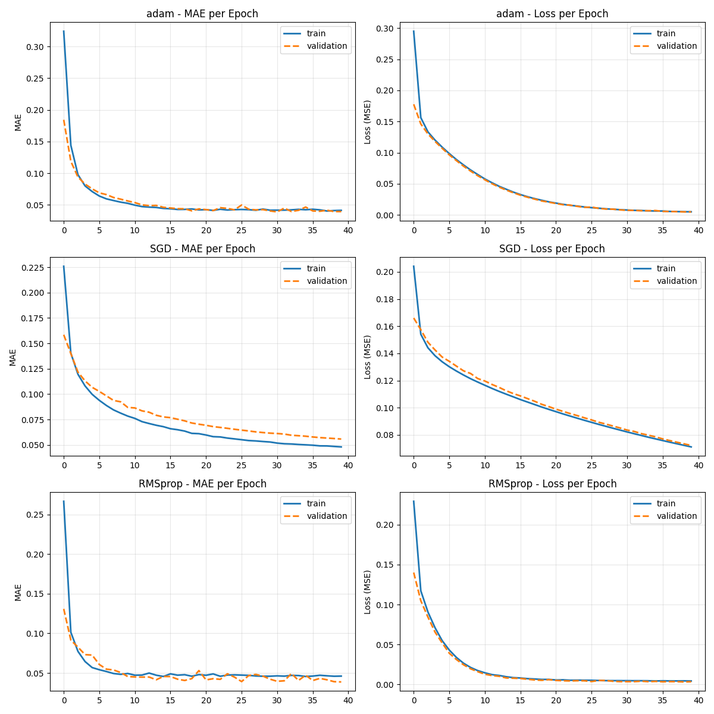

# Graduate Admissions Predictor - Regression Model
[](https://www.python.org/)
[](https://www.tensorflow.org/)
[](https://keras.io/)
[](https://scikit-learn.org/)
[](https://matplotlib.org/)

A deep learning regression model built with Tensorflow/Keras that predicts the probaility of a students's admission into a graduate program based on academic and profile features.

## Project Overview
This project builds and optimizes a neural network model to predict admission chances (0–1) for graduate school applicants. The model is trainedon the Graduate Admissions dataset from kaggle and it explores hyperparameter tuning across multiple batch sizes and optimizers, with training diagnostics visualised using Matplotlib.

## Dataset
**Source:** [Kaggle - Graduate Admissions Dataset](https://www.kaggle.com/datasets/mohansacharya/graduate-admissions)

| Feature | Description |
|---|---|
| GRE Score | Graduate Record Examination score (out of 340) |
| TOEFL Score | Test of English as a Foreign Language score (out of 120) |
| University Rating | Prestige of undergraduate institution (1–5) |
| SOP | Statement of Purpose strength (1–5) |
| LOR | Letter of Recommendation strength (1–5) |
| CGPA | Undergraduate GPA (out of 10) |
| Research | Research experience (0 = No, 1 = Yes) |
| **Chance of Admit** | **Target variable (0.0 – 1.0)** |

## Model Architecture

```
Input Layer  →  7 features
Dense(64)    →  ReLU activation + L2 Regularization (λ=0.01)
Dense(32)    →  ReLU activation
Dense(1)     →  Linear output (regression)
```

**Loss function:** Mean Squared Error (MSE)  
**Evaluation metrics:** RMSE, MAE, R² Score

---

## Features

- **Data preprocessing** — StandardScaler via ColumnTransformer (fitted on training data only to prevent leakage)
- **Hyperparameter tuning** — Batch size comparison across `[2, 4, 8, 16, 32]`
- **Optimizer comparison** — Adam, SGD, and RMSprop evaluated independently
- **Early stopping** — Monitors `val_loss` with `patience=5` and `restore_best_weights=True`
- **L2 Regularization** — Applied to first Dense layer to reduce overfitting
- **Best model selection** — Automatically saves the model with the lowest RMSE across optimizers
- **Training diagnostics** — MAE and Loss plotted per epoch for each optimizer

---

## Training Diagnostics

The model generates a 3×2 subplot figure comparing MAE and Loss curves across all three optimizers for both training and validation data.



The plot shows:
- Adam: Smooth convergence with stable train/validation curves
- SGD: Poor convergence and high validation loss
- RMSprop: Best test performance with stable learning curves

## Installation
### Prerequisites
```bash
pip install -r requirements.txt
```

1. Clone the repository
```bash
git clone <your-repo-url>
cd graduate-admissions-prediction
```

2. Download the dataset and place the admissions_data.csv in the project root directory

3. Run the project
```bash
python script.py
```

## Results
### Batch Size Comparison
| Batch Size| RMSE | MAE |
|---|---|---|
| 2 | 0.6661 | 0.0448 |
| 4 | 0.06683 | 0.0451 |
| 8 | 0.0703 | 0.0452 |
| 16 | 0.0893 |0.0433 |
| 32 | 0.1907 | 0.0501 |

Best batch size: 2 (RMSE: 0.661)

### Optimizer Comparison
| Optimizer | RMSE | MAE |
|---|---|---|
| Adam | 0.0676 | 0.0451 |
| SGD | 0.2676 | 0.0555 |
| RMSprop | 0.0746 | 0.0490 |

Best Optimizer: RMSprop (RMSE: 0.0683)

### Performance Metrics
- R² Score: 0.7924
- RMSE: 0.0683
- MAE: 0.0475
- Best Batch Size: 2
- Best Optimizer: RMSprop

## Key Findings
- Smaller batch sizes (2-4) perform better than larger ones
- RMSprop achieved the best test performance with RMSE of 0.0683
- Early stopping effectively stops training when validation loss plateaus
- SGD significantly underperforms compared to Adam and RMSprop

## Project Structure
```bash
├── script.py                          # Main script
├── admissions_data.csv              # Dataset
├── requirements.txt                 # Dependencies
├── static/
│   └── images/
│       └── my_plots.png            # Training history plots
├── README.md
└── LICENSE.md                        
```

## Example Prediction
```python
# [GRE, TOEFL, University Rating, SOP, LOR, CGPA, Research]
applicant = np.array([[320, 110, 4, 4.5, 4.0, 8.5, 1]])
applicant_scaled = ct.transform(applicant)
admission_chance = best_model.predict(applicant_scaled)

# Output: Predicted Admission Chance: 0.87
```

## Concepts Demonstrated

- Neural network regression with Keras Sequential API
- Data leakage prevention in preprocessing pipelines
- Hyperparameter tuning (batch size, optimizer)
- Regularization techniques (L2)
- Early stopping with best weight restoration
- Model evaluation with RMSE, MAE, and R²
- Training curve visualisation with Matplotlib

## License
This project is licensed under the MIT License - see the [LICENSE](LICENSE.md) file for details.
